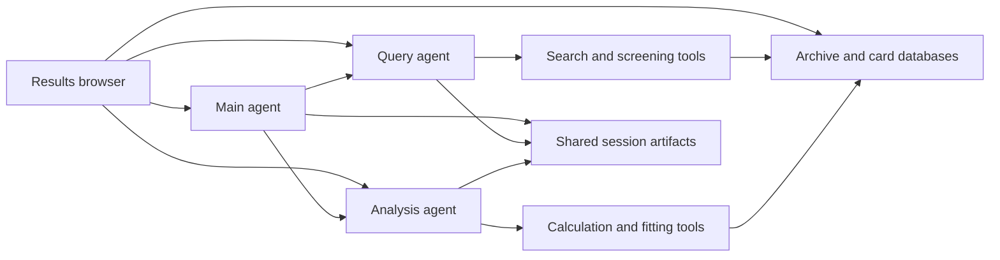

# ThermoML platform architecture

[Workspace setup](./README.md) · [Agent call hierarchy](./ThermoML_research_agent/README.md) · [Data inventory](./docs/DATA.md)

## Components

The project has two sibling code folders. `ThermoML_results_browser` owns the
Flask application, HTML/JavaScript interface, direct archive browsing, agent
launch/status/history views, and the local analysis workbench.
`ThermoML_research_agent` owns the three agents, the shared execution engine,
search/calculation pipelines, parsers/compactors, and database files.

The [agent README](ThermoML_research_agent/README.md) retains the refreshed source's detailed call
hierarchy, including Main delegation, Query L0/L1/L2 work, Analysis alignment,
compaction, memory, and post-answer evaluation. Those operations are implemented
under [NIST_ThermoML_agents](ThermoML_research_agent/NIST_ThermoML_agents/), including the reorganized
shared engine. The local rebuild preserves that hierarchy.

## Data representations

Data paths in this section are relative to `ThermoML_research_agent/`.

`ThermoML.v2020-09-30.db/thermoml_raw.db` provides raw JSON and query tables.
`thermoml_raw_corpus.db` is a separate compressed container for paired source
JSON/XML views. JSON in the raw query database is not a byte-for-byte XML copy.

`card_databases_storage` contains the search index, block registries, authored
knowledge cards, canonical CSV catalogs, and generated SQLite card stores.
The active property database is
`card_databases_storage/Individual_cards_dbs/PCS_INDIV.db`.

Cards are structured views for discovery and context management. A capped card
sample is not the complete measurement table. Use the raw-data extraction path
when a calculation needs the full selected dataset. Refer to [DATA.md](docs/DATA.md)
for inspected counts, exact filenames, provenance, and rebuild boundaries.

The [identifier specification](ThermoML_research_agent/card_databases_storage/ID_architecture.md) and
[parser schema](ThermoML_research_agent/ThermoML_raw_json_to_card_db_parsers/id_schema.py) define the
current scoped identifier contract. Preserve those identifiers through search,
compaction, analysis, and saved results. Do not substitute legacy labels or infer
an identifier merely from its appearance in old example output.

## Execution and artifacts

Main plans and delegates work. Query uses hierarchical retrieval and evaluation.
Analysis inspects data, runs supported calculations/fits, and can request more
retrieval. The shared engine manages requests, tool dispatch, memory, hooks,
compaction, subagents, and evaluation. Runtime workflow Markdown is part of that
behavior, rather than passive documentation.

Production entry APIs are linked from [USAGE.md](docs/USAGE.md). Each component
uses source-relative locations. Explicit session directories let child work stay
inside its parent's session. Default freeform roots are
`_output/Main`, `_output/Query`, and `_output/Analysis`, relative to the
repository root. Benchmark roots are the corresponding folders under
`_benchmark`. Diagnostic scripts use subfolders under `_output/Query/Diagnostics`.

There is no output-routing module or per-user output bucket. Browser history
reads shared artifacts, including the historical Main sessions in
`_output/freeform_runs.zip`. Benchmark collections also use ZIPs; the browser
reads saved artifacts directly without extracting the archives. Saved outputs may contain result text, working memory,
reasoning/history, statistics, CSVs, plots, and workflow figures; older sessions
can lack artifacts introduced later.

## Local validation and maintenance

The [development guide](docs/DEVELOPMENT.md) documents the checks available in
this checkout. The existing databases are used read-only for these checks. Database regeneration
requires its own source inputs and is not an installation step.

The browser shares run data between visitors. Provider identity belongs to the
server configuration and does not select an output bucket. Scientific validation,
read-only database access, and artifact path containment remain independent of
browser-user access.
