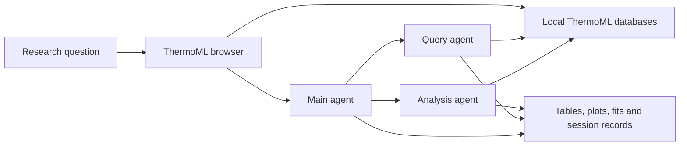

# ThermoML Agents

A research workspace for finding, interpreting, and analysing thermophysical data
from the NIST ThermoML Archive, using cooperating Main, Query, and Analysis agents.
The database browser also provides direct access to papers, data blocks, saved
agent runs, and analysis tools. This repository is the companion code and data
release for the manuscript *A traceable agentic framework for chemistry research
query and analysis with ThermoML database* (see [citing this work](#citing-this-work)).

The workspace uses the `v2020-09-30` archive snapshot of the
[NIST/TRC ThermoML Archive](https://trc.nist.gov/ThermoML/); see
[license, data source, and citation](#license-data-source-and-citation) for the
citations NIST requests. Answers and calculations can be inspected alongside the
literature IDs, DOIs, data blocks, tool histories, and session files that produced
them. See [data and provenance](docs/DATA.md) for the actual database inventory and
[benchmarks](docs/BENCHMARKS.md) for the supplied prompt suites and recorded runs.

## Start here

Use Python 3.13, the version validated with this workspace, and install Git LFS
before cloning. All SQLite databases use Git LFS; their nonempty payloads total
about 4.875 GB. Keep the code and [required databases](docs/DATA.md) together.

```shell
git lfs install
git clone https://github.com/Yunkai0825/ThermoML_agents_pub.git
cd ThermoML_agents_pub
git lfs pull
python -m pip install -r ThermoML_research_agent/requirements.txt
python launch_thermoml_browser.py
```

The launcher tries `http://127.0.0.1:5000`, selects a free port if 5000 is occupied,
and opens the printed URL in your default browser. Keep the terminal running;
press Ctrl+C to stop. Use `--port 5001` for a specific port, `--port 0` to choose
a free port, or `--no-browser` to start only the server.

Direct browsing and viewing saved results require no model credentials. Running
the agents requires the server's Argo API configuration. The benchmark launcher
also supports the direct Anthropic API. Installation, environment commands, and
provider limitations are explained in [installation and configuration](docs/INSTALLATION.md).

To check imports and the benchmark output plan without model calls:

```shell
python ThermoML_research_agent/run_debug_benchmark.py --offline
```

## How the pieces fit



| Component | Purpose |
| --- | --- |
| Main agent | Plans a response and delegates retrieval and analysis tasks. |
| Query agent | Resolves scientific entities and retrieves literature and data blocks. |
| Analysis agent | Inspects retrieved data and runs supported thermophysical calculations and fits. |
| Database browser | Browses the archive, launches agents, and displays saved results and workflow figures. |
| Parsers, compactors, and search tools | Build and consume structured cards while retaining identifiers and provenance. |

## Workspace layout

```text
ThermoML_agents_pub/
├── launch_thermoml_browser.py
├── ThermoML_database_browser/     # Flask app, templates and tools
├── ThermoML_research_agent/       # Agents, search/calculation code and databases
├── _benchmark/                   # Main, Query and Analysis benchmark records
├── _output/                      # Shared freeform sessions and diagnostics
├── docs/                         # Installation, usage, data and reproduction guides
└── tests/                        # Local maintainer tests; excluded from publication
```

Directories named `test` or `tests` are excluded by `.gitignore`; see
[included offline checks](docs/DEVELOPMENT.md) for validation available in a clone.

Each component declares its own locations relative to its source file. There is
no shared output-routing module. Freeform runs are saved persistently under
`_output/{Main,Query,Analysis}` for everyone; closing a browser tab does not remove
them. Existing Main runs directly under `_output/run_*` remain browsable.
Benchmarks use `_benchmark/{Main,Query,Analysis}`. Explicit API `session_dir` and
runner `--output` arguments remain available.

All browser visitors can access raw JSON and detailed run views. The root launcher
binds to localhost. Browser accounts and debug-access gates are not part of this
standalone workspace.

## Documentation

- [Installation, providers, and troubleshooting](docs/INSTALLATION.md)
- [Browser, terminal, and Python usage](docs/USAGE.md)
- [Database files, provenance, and rebuild boundaries](docs/DATA.md)
- [Benchmarks and recorded outputs](docs/BENCHMARKS.md)
- [Development and offline validation](docs/DEVELOPMENT.md)
- [Publication and data distribution](docs/PUBLICATION.md)
- [Browser reference](ThermoML_database_browser/README.md)
- [Agent architecture and component documentation](ThermoML_research_agent/README.md)

## License, data source, and citation

The code is distributed under the [MIT license](LICENSE). The databases, generated
cards, and recorded outputs contain or derive from the **NIST/TRC ThermoML Archive**
(snapshot `v2020-09-30`), produced by the Thermodynamics Research Center at the
National Institute of Standards and Technology and published as public data with
the permission of the cooperating journal publishers. That content is not covered
by the MIT license; see the third-party data notice in [NOTICE](NOTICE) and the
provenance details in [DATA.md](docs/DATA.md). NIST/TRC provide the archive
without warranty of correctness; verify values against the source publication
before relying on them.

NIST asks that published research using ThermoML data cite:

- Riccardi, D.; Trautt, Z.; Bazyleva, A.; Paulechka, E.; Diky, V.; Magee, J. W.;
  Kazakov, A. F.; Townsend, S. A.; Muzny, C. D. *Towards improved FAIRness of the
  ThermoML Archive.* J. Comput. Chem. **2022**, 43 (12), 879–887.
  [doi:10.1002/jcc.26842](https://doi.org/10.1002/jcc.26842)
- Riccardi, D.; Bazyleva, A.; Paulechka, E.; Diky, V.; Magee, J. W.; Kazakov, A. F.;
  Townsend, S. A.; Muzny, C. D. *ThermoML/Data Archive*; National Institute of
  Standards and Technology, **2021**.
  [doi:10.18434/mds2-2422](https://doi.org/10.18434/mds2-2422)

For software citation, use [CITATION.cff](CITATION.cff), which also lists these
references, and record the commit or release you used.

### Citing this work

The framework is described in:

> Yunkai Sun<sup>a,b,‡</sup>, Adwaith Ravichandran<sup>c,‡</sup>, Hassan Harb<sup>a,d,‡</sup>,
> Rajeev S. Assary<sup>a,d</sup>, Brian J. Ingram<sup>a,b,\*</sup>, Zhenzhen Yang<sup>a,b,\*</sup>.
> *A traceable agentic framework for chemistry research query and analysis with
> ThermoML database.* Manuscript, 2026.
>
> <sup>a</sup> Center for Steel Electrification by Electrosynthesis, Argonne National
> Laboratory, Lemont, IL 60439, USA · <sup>b</sup> Chemical Sciences and Engineering
> Division, Argonne National Laboratory · <sup>c</sup> Physics Division, Argonne National
> Laboratory · <sup>d</sup> Materials Science Division, Argonne National Laboratory ·
> <sup>‡</sup> Equal contributions · <sup>\*</sup> Corresponding authors:
> [yangzhzh@anl.gov](mailto:yangzhzh@anl.gov), [ingram@anl.gov](mailto:ingram@anl.gov)

[CITATION.cff](CITATION.cff) carries this reference as its `preferred-citation`,
which GitHub's "Cite this repository" button renders. The journal reference and
DOI will be added when available.
