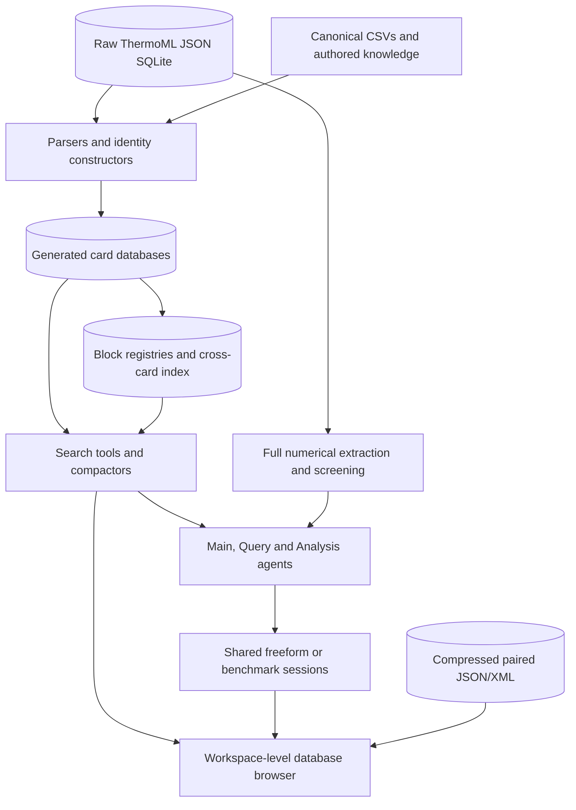

# ThermoML platform architecture

This document maps the current source tree, data representations, and execution
boundaries. Start with the [workspace README](../README.md) for installation and
launching, or the [data inventory](../docs/DATA.md) for inspected database counts,
provenance, and rebuild limitations. Paths below are relative to
`ThermoML_research_agent/` unless a workspace-relative path is explicitly shown.

## Platform flow



The raw query database and compressed corpus serve different consumers.
`ThermoML.v2020-09-30.db/thermoml_raw.db` stores paper JSON and query indexes;
parsers and numerical tools read that representation. The adjacent
`thermoml_raw_corpus.db` stores independently compressed JSON/XML documents for
source browsing. JSON text does not establish byte identity with XML. The
[raw corpus reader](../ThermoML_database_browser/helpers/raw_corpus.py) retrieves
individual documents without extracting the entire container.

Derived cards, registries, and compacted Markdown provide increasingly focused
views of the source. Card previews can contain fewer numerical rows than the raw
paper. Their role and limits are described below; the database inventory is kept
in [DATA.md](../docs/DATA.md) rather than duplicated as fixed architecture counts.

## Source tree and responsibilities

```text
workspace/
├── ThermoML_research_agent/
│   ├── ThermoML.v2020-09-30.db/          Raw query and compressed corpus stores
│   ├── card_databases_storage/          Cards, registries, schemas, canonical IDs
│   ├── ThermoML_raw_json_to_card_db_parsers/
│   ├── ThermoML_card_json_to_md_compactors/
│   ├── card_db_search_tools/
│   ├── specialized_tools_pipelines/
│   ├── NIST_ThermoML_agents/
│   │   ├── general_db_query_engine/
│   │   ├── _NIST_ThermoML_main_agent/
│   │   ├── NIST_ThermoML_query_agent/
│   │   ├── NIST_ThermoML_analysis_agent/
│   │   └── NIST_ThermoML_editing_agent(stub)/
│   ├── run_debug_benchmark.py
│   └── build_raw_corpus_archive.py
├── ThermoML_database_browser/           Flask app and saved-run views
├── _output/                            Shared freeform results and diagnostics
├── _benchmark/                         Benchmark campaigns
├── docs/                               Workspace usage and maintenance guides
└── tests/                              Workspace regression checks
```

| Component | Responsibility and implementation reference |
|---|---|
| Parsers | Turn raw paper JSON into typed card records; [card_orchestrator.py](ThermoML_raw_json_to_card_db_parsers/card_orchestrator.py) coordinates per-DOI builders. |
| Data storage | Separate global identity/domain-knowledge cards from paper-level cards and block indexes; see [storage architecture](card_databases_storage/ARCHITECTURE.md). |
| Compactors | Render selected card fields and data topology as bounded Markdown; see [compactor architecture](ThermoML_card_json_to_md_compactors/ARCHITECTURE.md). |
| Search tools | Resolve identities, search blocks and systems, read related cards, and extract numeric tables; see [tool directory](card_db_search_tools/README.md). |
| Property screening | Align source curves, units, composition, and conditions before ranking; see [pipeline contracts](specialized_tools_pipelines/property_screening_ranking_tool/README.md). |
| Agent runtime | Provider calls, tool catalogs, validation, delegation, context, and session lifecycle; see [agent architecture](NIST_ThermoML_agents/ARCHITECTURE.md). |
| Browser | Search data, inspect source documents, launch agents, and display saved artifacts; see [browser README](../ThermoML_database_browser/README.md). |

The Editing directory is a stub. The executable agent entrypoints are Main,
Query, and Analysis. The browser is a sibling of the research-agent project at
the workspace root.

## Cards, registries, and source fidelity

The active card families describe different aspects of the same literature:

| Family | Information represented | Schema reference |
|---|---|---|
| RMS | Citation and publication metadata | [Reference Metadata](card_databases_storage/_card_schemas/_core_data_cards_schema/Reference_Metadata_Schema) |
| CCS | Global compound identity/knowledge and paper-local compounds, samples, and preparation | [Component Cards](card_databases_storage/_card_schemas/_core_data_cards_schema/Component_Card_Schema) |
| MTDKS | Measurement identity/knowledge and paper-specific method information | [Measurement Technology](card_databases_storage/_card_schemas/_core_data_cards_schema/MeasTech_DomainKnowledge_Schema) |
| PCS | Property identity/knowledge and paper-specific property/reaction blocks | [Property Cards](card_databases_storage/_card_schemas/_core_data_cards_schema/Property_Card_Schema) |

Global `ID_DK` databases and per-paper `INDIV` databases live under
[`Individual_cards_dbs/`](card_databases_storage/Individual_cards_dbs). The
property and reaction registries and `ThermoML_index.db` live directly under
`card_databases_storage/`. The similarly named root-level `PCS_INDIV.db` is an
empty placeholder; runtime tools use the database under `Individual_cards_dbs`.
Auxiliary schema designs in [`_aux_data_cards_schema/`](card_databases_storage/_card_schemas/_aux_data_cards_schema)
do not imply additional active SCS or USS SQLite databases.

[`card_orchestrator.parse_doi`](ThermoML_raw_json_to_card_db_parsers/card_orchestrator.py)
loads one paper from `papers.json_data` and invokes RMS, CCS, MTDKS, PCS, and
compound-identity builders. Bulk database generation uses separate builders;
calling the orchestrator is not a rebuild of every database and registry.
Canonical catalogs and authored knowledge inputs also participate in generation.

PCS construction has a configurable stored-point cap, with a default of 50
points per block in the included builder. Summaries may describe the full block
while the card's materialized point list is capped. Compaction can further omit
fields or shorten displays. Neither a card preview nor a Markdown rendering
should be treated as the complete numerical dataset.

For analysis, [`extract_block_csv`](card_db_search_tools/basic_search_tools/11_block_data_extractor.py)
uses PCS definitions and uncapped raw ThermoML `NumValues`. The
[advanced block-search implementation](card_db_search_tools/basic_search_tools/advanced_block_search)
also reads raw rows when applying exact numerical constraints. Preserve DOI,
typed block identity, source units, phase, composition, and conditions when
moving from discovery to numerical work.

## Identifier scopes and cross-references

[`id_schema.py`](ThermoML_raw_json_to_card_db_parsers/id_schema.py) defines and
validates the generated identifier grammar. The
[identifier architecture](card_databases_storage/ID_architecture.md) explains its
use across cards and registries. In the patterns below, `N` and `M` stand for
positive integer ordinals, not literal suffixes.

| Scope | Current patterns | Required context |
|---|---|---|
| Global literature | `GLOBlit_N` | Canonical DOI mapping |
| Global compound, property, measurement | `GLOBcomp_N`, `GLOBprop_N`, `GLOBmeas_N` | Matching canonical catalog |
| Other global categories | `GLOBvar_N`, `GLOBconstr_N`, `GLOBphase_N`, `GLOBblocktype_N`, `GLOBrxntype_N`, `GLOBsolvent_N` | Identifier field and canonical catalog |
| Paper-local compound/sample | `DOIcomp_N`, `DOIcompSample_N_M` | DOI |
| Paper-local block | `PROPblock_N`, `RXNblock_N` | DOI and block type |
| Block-local entities | `BLKprop_N`, `BLKvar_N`, `BLKconstr_N`, `BLKpoint_N`, `BLKsubsys_N` | DOI and block ID |
| Property assessment | `BLKpropAssessment_N_M` | DOI and block ID |

Raw ThermoML ordinal fields such as `nOrgNum` and `nPropNumber` are source fields;
constructors translate them before writing generated IDs. Local identifiers
must travel with their enclosing context. Names, CAS numbers, and InChIKeys are
identity attributes used in resolution; they do not replace scoped identifiers.
Retired unscoped forms such as `comp_1` and `block_1` are rejected.

The [canonical CSV directory](card_databases_storage/Canonicalized_ID_name_lists_csvs)
provides mappings shared by producers and consumers. In particular,
`reference_ids.csv` connects DOIs to `GLOBlit` IDs. PCS identity-translation
metadata records the corresponding catalog hash; related databases and CSVs
must be distributed as a coherent set.

## Discovery and numerical analysis

A typical request resolves names into canonical identities, searches for
matching systems or blocks, inspects relevant paper/compound/method/property
cards, and then extracts full numerical evidence when needed. This is a useful
reading strategy; each agent's actual tool availability and delegation behavior
are defined by its catalog and workflow.

The [basic search APIs](card_db_search_tools/basic_search_tools/ARCHITECTURE.md)
cover identity, literature, system, block, and data-extraction operations.
Compound-, measurement-, block-, and DOI-centric helpers combine related
lookups. Card compactors and tool-result compactors adapt those structured
results for model context and browser displays.

The [property-screening pipeline](specialized_tools_pipelines/property_screening_ranking_tool/README.md)
reconstructs uncapped source blocks and applies numerical and semantic checks
before ranking comparable systems. Its deterministic processing preserves
individual source curves and restricts interpolation to the selected curve's
reported range. Agent-facing confirmation and result-observer stages are
separate from these numerical transformations; consult the pipeline's contracts
for the complete sequence and saved evidence.

## Agent execution and saved artifacts

Main coordinates whole requests and delegates to Query and Analysis. Query has
an L0 orchestrator, L1 query workers, and L2 evidence evaluators. Analysis combines
retrieval with composition alignment, baseline calculations, fitting, and
diagnostics. Their public APIs, provider configuration, catalogs, hook lifecycle,
and continuation behavior are documented in the
[agent architecture](NIST_ThermoML_agents/ARCHITECTURE.md) and
[API examples](NIST_ThermoML_agents/README.md).

Provider credentials identify an API account. Browser user state does not select
an output bucket. Default paths are declared in each owning config, UI, or
runner and are resolved from the checkout location.

| Entry point | Default path relative to workspace root |
|---|---|
| Main freeform | `_output/Main/run_*` |
| Analysis freeform | `_output/Analysis/run_*` |
| Query terminal UI | `_output/Query/run_*` |
| Query Python API | Caller supplies `session_dir` or `memory_path` |
| Main, Query, or Analysis benchmark | `_benchmark/<Agent>/test_run_*/Q<prompt_id>/` |
| Parser/compactor diagnostics | `_output/Query/Diagnostics/` |

Benchmark runners supply explicit per-prompt session locations. A custom
`--output` contains the campaign and its sessions. Nested subagent work remains
under the parent session. See [benchmark commands and artifacts](../docs/BENCHMARKS.md).

Saved files depend on the tools executed: they can include answers, histories,
working memory, events, references, CSVs, and plots. Completed root sessions
invoke [workflow generation](NIST_ThermoML_agents/general_db_query_engine/general_posteval_helpers/compaction_funnels/api.py)
under `<session>/workflow/`; saved child sessions are represented in the root's
delegation tree. The browser reads these artifacts through its own backend.

## Operating and maintaining the platform

Use the supplied data stores directly for search, agent execution, and browsing.
Individual builders can replace generated assets, and they require matching raw
data, catalogs, and knowledge inputs. The repository does not provide a single
validated command that reconstructs every asset from a fresh NIST download.
The [data maintenance guide](../docs/DATA.md) documents available builders,
missing raw-import steps, compressed-corpus requirements, and consistency checks.

When changing a representation, follow its dependencies through identifiers,
card builders, registries, search tools, compactors, and consuming agents.
Preserve source context and validate the affected layer before running a live
benchmark. Use [development and offline checks](../docs/DEVELOPMENT.md) for test
commands and distinguish their results from provider-backed evaluation.

| Documentation | Use |
|---|---|
| [Installation](../docs/INSTALLATION.md) | Dependencies, data prerequisites, provider setup |
| [Usage](../docs/USAGE.md) | Browser, terminal, and Python entrypoints |
| [Data inventory](../docs/DATA.md) | Provenance, inspected stores, limits, and maintenance |
| [Benchmarks](../docs/BENCHMARKS.md) | Campaign execution and output conventions |
| [Development](../docs/DEVELOPMENT.md) | Offline validation and extension workflow |
| [Publication](../docs/PUBLICATION.md) | Distribution, license, and citation guidance |
