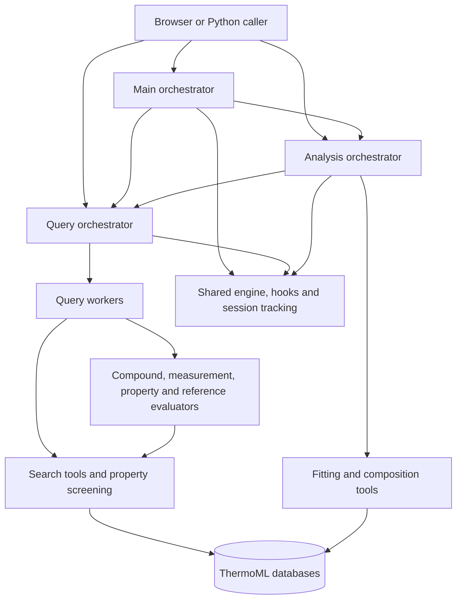

# NIST ThermoML agents

This package provides three cooperating agents for searching the ThermoML card
databases and analysing retrieved thermophysical data. The browser is a sibling
workspace component: [ThermoML database browser](../../ThermoML_database_browser/README.md).

## Agent entry points

| Agent | Responsibility | Public API |
|---|---|---|
| [Main](_NIST_ThermoML_main_agent/README.md) | Delegate scientific tasks to Query and Analysis, coordinate parallel work, and combine results | [`ThermoML_main_run`](_NIST_ThermoML_main_agent/ThermoML_main_api.py) |
| [Query](NIST_ThermoML_query_agent/README.md) | Resolve identifiers, find systems and publications, inspect supporting cards, and return grounded results | [`ThermoML_query_run`](NIST_ThermoML_query_agent/ThermoML_query_api.py) |
| [Analysis](NIST_ThermoML_analysis_agent/README.md) | Retrieve and align data, fit Redlich–Kister models, compute baselines, and export diagnostics | [`ThermoML_analysis_run`](NIST_ThermoML_analysis_agent/ThermoML_analysis_api.py) |

`NIST_ThermoML_editing_agent(stub)/` is a placeholder; it has no production editing API.



## Python usage

Install the dependencies using the [workspace setup instructions](../../README.md),
then run Python from `ThermoML_research_agent/` so `NIST_ThermoML_agents` is importable.
Live agent calls require the server/process provider configuration, including
`ARGO_API_USER` for Argo. Database browsing and deterministic tool tests do not
require a live LLM request.

```python
from pathlib import Path
from NIST_ThermoML_agents.NIST_ThermoML_query_agent.ThermoML_query_api import ThermoML_query_run
from NIST_ThermoML_agents.NIST_ThermoML_analysis_agent.ThermoML_analysis_api import ThermoML_analysis_run
from NIST_ThermoML_agents._NIST_ThermoML_main_agent.ThermoML_main_api import ThermoML_main_run

# Run this example from ThermoML_research_agent/.
workspace = Path.cwd().parent
query = ThermoML_query_run(
    "Find density data for ethanol and water near 298 K.",
    session_dir=workspace / "_output" / "Query" / "example_query",
)
print(query.answer)

# Main and Analysis create new sessions in their default output directories.
analysis = ThermoML_analysis_run("Fit excess enthalpy data for ethanol and water.")
main = ThermoML_main_run("Find ethanol-water data and compare its reported trends.")
print(analysis.session_dir, main.session_dir)
```

Query requires a `session_dir` or `memory_path`. Main and Analysis also accept
explicit `session_dir` values. Reusing a directory is appropriate for a deliberate
continuation; use a new directory for an independent Query run.

Query returns `AgentTurnResult`; Main and Analysis return `MainRunResult` and
`AnalysisRunResult`. Consult the API signatures for continuation, client injection,
and verdict options. Each result includes the answer and execution information;
Main and Analysis also expose the session directory and generated files.

## Output and artifacts

Paths below are relative to the workspace root, one directory above
`ThermoML_research_agent/`.

| Use | Destination |
|---|---|
| Main, Query and Analysis freeform sessions | `_output/<Agent>/` |
| Per-agent benchmark campaigns | `_benchmark/<Agent>/test_run_<timestamp>/` |
| A benchmark prompt's full session | `<campaign>/Q<prompt_id>/` |
| Workflow figures, tables and audits | `<session>/workflow/` |

All freeform output is shared and persistent. There are no browser-account buckets,
output-routing modules, or debug-access requirements. Each component declares its
paths from its source location. Explicit API session paths and runner `--output`
arguments take precedence over defaults.

Completed root sessions generate workflow artifacts automatically. Child sessions
are included in their parent's workflow; generation errors are reported without
failing the completed agent answer. See the
[workflow artifact reference](general_db_query_engine/general_posteval_helpers/compaction_funnels/README.md).

## Benchmarks and offline checks

From `ThermoML_research_agent/`:

```powershell
# Imports, configuration and output plan; no network or LLM request.
python run_debug_benchmark.py --offline

# Live prompt benchmarks; requires configured provider access.
python -m NIST_ThermoML_agents._NIST_ThermoML_main_agent._DEBUG_script.run_tests --workers 1
python -m NIST_ThermoML_agents.NIST_ThermoML_query_agent._DEBUG_script.run_tests 1.1 2.1 --workers 1
python -m NIST_ThermoML_agents.NIST_ThermoML_analysis_agent._DEBUG_script.run_tests --section 2
```

Each runner supports `--output`, `--workers`, `--gap`, and `--skip-existing`.
The combined launcher supports `--go`, `--resume <timestamp>`, and its optional
Anthropic backend. The [shared runner reference](general_db_query_engine/general_DEBUG_test_runner_helpers/README.md)
describes callbacks and artifacts; [Query benchmark usage](NIST_ThermoML_query_agent/_DEBUG_script/README.md)
describes its per-prompt files.

Offline regression suites are documented in the [workspace README](../../README.md).
The `run_tests.py` prompt runners are live benchmarks, not substitutes for those
unit and database regression suites.

## Code and configuration map

All `general_*` shared packages live beneath `general_db_query_engine/`.

| Area | Reference |
|---|---|
| Current architecture and execution boundaries | [ARCHITECTURE.md](ARCHITECTURE.md) |
| Platform data and card architecture | [MASTER_ARCHITECTURE.md](../MASTER_ARCHITECTURE.md) |
| Main model, provider and budget settings | [ThermoML_main_argo_config.py](_NIST_ThermoML_main_agent/ThermoML_main_argo_config.py) |
| Query model, provider and budget settings | [ThermoML_query_argo_config.py](NIST_ThermoML_query_agent/ThermoML_query_argo_config.py) |
| Analysis model, provider and budget settings | [ThermoML_analysis_argo_config.py](NIST_ThermoML_analysis_agent/ThermoML_analysis_argo_config.py) |
| ReAct engine and configuration context | [general_argo_engine_helpers](general_db_query_engine/general_argo_engine_helpers/README.md) |
| Tool catalogs, dispatch and compaction | [general_tool_management_helpers](general_db_query_engine/general_tool_management_helpers/README.md) |
| Tracking, memory and lifecycle hooks | [general_hooks_management_helpers](general_db_query_engine/general_hooks_management_helpers/README.md) |
| Nested agent execution | [general_subagent_delegation_helpers](general_db_query_engine/general_subagent_delegation_helpers/README.md) |
| Database and CSV paths | [general_ThermoML_db_csv_registry](general_db_query_engine/general_ThermoML_db_csv_registry/README.md) |
| Typed workflow Markdown | [general_subagent_skill_schema_and_parser](general_db_query_engine/general_subagent_skill_schema_and_parser/README.md) |

Tool membership and numeric runtime limits are defined by the code and per-agent
configs. They are not fixed by counts in documentation diagrams.
