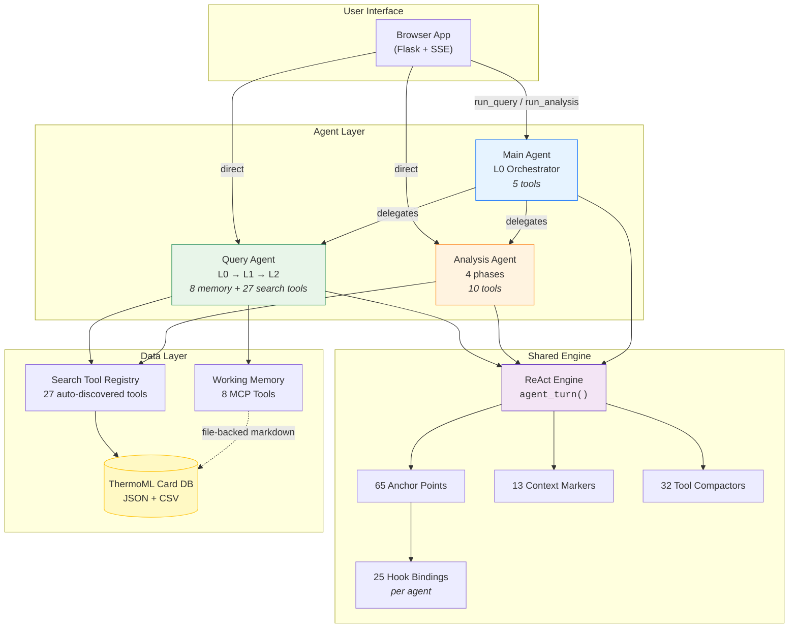

# NIST ThermoML Agents

Multi-agent system for querying, analysing, and editing the ThermoML card
database via natural language.  Built on a shared ReAct engine with
anchor-point hook dispatch, LLM-driven context management, and
file-backed structured working memory.

---

## Agent Roster

| Agent | Directory | Role | API Entry Point |
|-------|-----------|------|-----------------|
| **Query** | `NIST_ThermoML_query_agent/` | Hierarchical DB search (L0→L1→L2) | `ThermoML_query_run(question)` |
| **Analysis** | `NIST_ThermoML_analysis_agent/` | Redlich-Kister fitting + diagnostics | `ThermoML_analysis_run(question)` |
| **Main** | `_NIST_ThermoML_main_agent/` | Master orchestrator routing to Query + Analysis | `ThermoML_main_run(question)` |
| **Editing** | `NIST_ThermoML_editing_agent(stub)/` | *(placeholder — future PDF→ThermoML ingest)* | — |

---

## Agent Network



---

## System Stats at a Glance

| Metric | Count | Details |
|--------|------:|---------|
| **Agents** | 3 + 1 stub | Query, Analysis, Main + Editing (placeholder) |
| **Anchor points** | 65 | 5 engine + 10 memory + 31 context + 19 tool |
| **Hook bindings** | 25 / agent | Identical wiring across all 3 active agents |
| **Tools (Query)** | 8 + 27 | 8 memory MCP tools + 27 shared search tools + L1 dispatch |
| **Tools (Analysis)** | 10 | 2 query + 2 data + 6 fitting |
| **Tools (Main)** | 5 | 3 subagent delegation + 2 tool browsing |
| **Search tools** | 27 | Auto-discovered across 4 categories |
| **Compactors** | 32 | 17 query + 13 analysis + 2 main |
| **Context markers** | 13 | XML tag families (`<tool_call>`, `<reasoning>`, `<answer>`, …) |
| **Memory MCP tools** | 8 | read, append, add_result, catalog_{add,remove,list}, compact, reset |

### Agent Architecture Comparison

| Agent | Tiers | Key Pattern |
|-------|-------|-------------|
| **Query** | L0 → L1 → L2 | Hierarchical decomposition; L0 orchestrates, L1 workers search, L2 leaves extract |
| **Analysis** | 4 sequential phases | Planning → Data Retrieval → Fitting → Verdict |
| **Main** | 1 tier (L0) | Pure orchestrator — delegates to Query + Analysis subagents |

---

## Quick Start

```python
# Query: search the ThermoML database
from NIST_ThermoML_agents.NIST_ThermoML_query_agent.ThermoML_query_api import ThermoML_query_run
result = ThermoML_query_run("What VLE data exists for ethanol-water?")
print(result.answer)

# Analysis: fit thermodynamic data
from NIST_ThermoML_agents.NIST_ThermoML_analysis_agent.ThermoML_analysis_api import ThermoML_analysis_run
result = ThermoML_analysis_run("Fit excess enthalpy of ethanol-water at 298 K")
print(result.answer)

# Main: orchestrate both agents
from NIST_ThermoML_agents._NIST_ThermoML_main_agent.ThermoML_main_api import ThermoML_main_run
result = ThermoML_main_run("Compare density data for hexane-heptane and fit it")
print(result.answer)
```

Query returns `AgentTurnResult` (`.answer`, `.iterations`, `.elapsed_seconds`,
`.tool_history`, `.timed_out`).  Analysis and Main return richer dataclasses
(`AnalysisRunResult` / `MainRunResult`) that add `.verdict`, `.session_dir`,
and `.output_files`.

---

## Shared Infrastructure

| Package | Purpose |
|---------|---------|
| `general_argo_engine_helpers/` | ReAct engine, `EngineConfig`, `ArgoClient`, `AnchorPoint` (65 anchor types), `anchor()` dispatch, singleton patching |
| `general_text_context_marker_catalog/` | 13 XML tag families (`<tool_call>`, `<reasoning>`, `<answer>`, …) |
| `general_hooks_management_helpers/` | Parent for context hooks, memory management, and output writers |
| ↳ `general_context_hooks/` | `HistoryRecorder`, `StatsRecorder`, `TimeBudgetTracker`, `ReasoningTokenTracker`, LLM compaction engine, internal error logging |
| ↳ `general_memory_management_tools_hooks_helpers/` | `WorkingMemory`, `SessionManager`, 8 MCP tools, `make_instrumented_wrapper()` |
| ↳ `general_tracking_hooks_output_helpers/` | Output writers, answer cleaner |
| `general_tool_management_helpers/` | `AgentToolCatalog`, `ToolEntry`, `CompactorCatalog`, `PreExecutionGuidance`, health checks, agentic KEEP/DISCARD compactor |
| `general_subagent_delegation_helpers/` | Shared delegation primitives: session nesting (`preserve_active_session`), question building, result extraction, parallel dispatch, tracking merge |
| `general_db_search_tool_registry/` | 27 auto-discovered search tools across 4 categories |
| `general_subagent_skill_schema_and_parser/` | Workflow `.md` parser + tool-description generators |
| `general_ThermoML_db_csv_registry/` | Central registry of DB/CSV paths |
| `general_DEBUG_test_runner_helpers/` | Shared test-runner infrastructure |

---

## Coding Discipline & Design Principles

For architectural reference and the anchor-hook protocol, see
[ARCHITECTURE.md](ARCHITECTURE.md).

---

## Benchmark prompt runners

Each agent has a `_DEBUG_script/run_tests.py` that calls the public API
against test prompts:

```bash
cd NIST_ThermoML_agents/NIST_ThermoML_query_agent/_DEBUG_script
python run_tests.py

cd NIST_ThermoML_agents/NIST_ThermoML_analysis_agent/_DEBUG_script
python run_tests.py

cd NIST_ThermoML_agents/_NIST_ThermoML_main_agent/_DEBUG_script
python run_tests.py
```

Output goes to `_benchmark/<Agent>/test_run_<timestamp>/` at the workspace root.
Freeform sessions use shared `_output/Main`, `_output/Query`, and `_output/Analysis` directories.

---

## Directory Layout

```
NIST_ThermoML_agents/
├── ARCHITECTURE.md                         ← System architecture
├── README.md                               ← This file
├── __init__.py
│
├── general_argo_engine_helpers/            ← Shared ReAct engine
├── general_text_context_marker_catalog/    ← XML tag definitions
├── general_hooks_management_helpers/       ← Context hooks + memory + output
├── general_tool_management_helpers/        ← Tool catalogs + compactors
├── general_subagent_delegation_helpers/    ← Shared delegation primitives
├── general_db_search_tool_registry/        ← 27 auto-discovered search tools
├── general_subagent_skill_schema_and_parser/
├── general_ThermoML_db_csv_registry/
├── general_DEBUG_test_runner_helpers/
│
├── NIST_ThermoML_query_agent/              ← Query agent (L0→L1→L2)
├── NIST_ThermoML_analysis_agent/           ← Analysis agent (fitting)
├── _NIST_ThermoML_main_agent/              ← Main agent (orchestrator)
└── NIST_ThermoML_editing_agent(stub)/      ← Future editing agent
```
