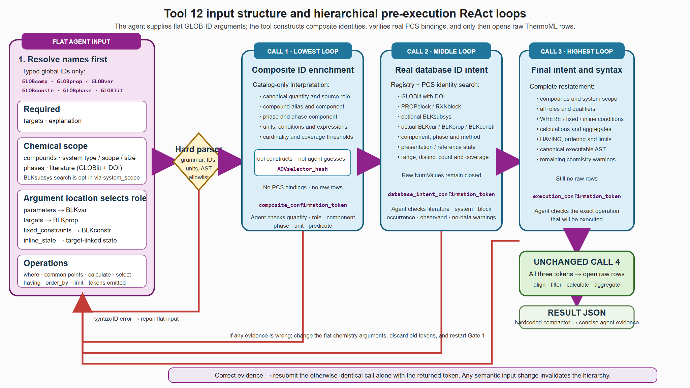

# Tool 12 input structure and pre-execution ReAct loops



Editable/vector versions: [SVG](tool12_input_and_react_loops.svg) · [Mermaid source](tool12_input_and_react_loops.mmd)

The agent supplies a shallow request: `targets` and `explanation` are required,
while chemical scope, occurrence declarations, predicates, calculations, and
result operations are optional flat strings or flat lists of strings. Names must
first be resolved to typed global IDs. The ID prefix does **not** determine how a
quantity is used: placement in `parameters`, `targets`, `fixed_constraints`, or
`inline_state` requests a variable, property, constraint, or target-linked state
occurrence, respectively.

A composite search identity is constructed rather than guessed. For example,
`GLOBprop_2 AS methane_x COMPONENT methane PHASE GLOBphase_3` inside
`parameters` means: resolve the global mole-fraction quantity, require its
variable representation, bind it to the compound alias `methane` and gas phase,
then apply its cardinality and coverage rules. Gate 1 returns that interpretation
and its deterministic `ADVselector_*` identity; Gate 2 shows which real
`BLKvar_N` occurrences satisfy it in specific `GLOBlit`/DOI/block records.

The framework confirms each gate automatically. Every gate remains
content-addressed and fail-closed: the tool internally compares the returned
evidence hashes and the live database state, then resubmits the otherwise
unchanged plan with the next token. One public call therefore either fails
closed with a specific validation error or executes the fully reviewed plan;
raw ThermoML values remain inaccessible until all three gates have
confirmed internally. The calling agent never emits confirmation tokens; it
verifies the returned binding evidence post-execution and revises the flat
arguments if the chemistry is wrong (which restarts the internal hierarchy
on the next call).

## Compact input example

```python
block_search_adv(
    compounds=[
        "GLOBcomp_51 AS methane",
        "GLOBcomp_3 AS carbon_dioxide",
    ],
    compound_match="exact",
    system_type="binary",
    parameters=[
        "GLOBprop_2 AS methane_x COMPONENT methane "
        "PHASE GLOBphase_3 MIN_FINITE 3 MIN_DISTINCT 2"
    ],
    targets=[
        "GLOBprop_34 AS conductivity PHASE GLOBphase_3 MIN_FINITE 3"
    ],
    literature=[
        "GLOBlit_1",
        "DOI=10.1007/s10765-005-5566-6",
    ],
    where="methane_x BETWEEN 0.2[1] AND 0.8[1]",
    select="MEAN(conductivity) AS mean_conductivity",
    explanation="Find conductivity over the requested methane composition range.",
)
```

The single call executes after the internal gates confirm; the executed
result carries the confirmed review evidence under ``preexecution_review``.

For executable minimum, recommended-simple, and maximum-meaningful examples
validated against the live databases, see
[`ARGUMENT_COMPLEXITY_EXAMPLES.md`](ARGUMENT_COMPLEXITY_EXAMPLES.md).
