# ThermoML property screening and ranking

`screen_property_systems` compares experimentally reported quantities across
chemically comparable ThermoML systems. The agent supplies only typed global
identifiers and a flat ranking intent. The tool resolves the chemistry,
reconstructs uncapped block data, converts units and composition definitions,
selects one complete experimental block curve for each comparable system,
interpolates that curve independently, and ranks the resulting systems.

The central invariant is:

```text
many DOI/block evidence series
    -> one source-local curve per evidence series
    -> one selected complete block-local curve per
       (system, target, phase, normalized constraint state)
    -> strict interpolation inside that selected curve's reported hull
    -> one scalar ranking value per system
    -> authoritative primary cross-system ranking
    -> independent ordered secondary-coordinate rankings
```

Raw points or property values from different papers or blocks are never
averaged into a synthetic curve. Every competing curve is scored as a whole;
the winner and all rejected alternatives are recorded before interpolation.

## Architecture

```mermaid
flowchart LR
    A["Flat GLOB-ID request"] --> B["Parse and deterministic enrichment"]
    B --> C{"Agent confirms enriched request?"}
    C -->|No| B
    C -->|Yes| D["1. Candidate discovery"]
    D --> E["2. Gather complete authoritative blocks"]
    E --> F["3. Align every block field to registry units"]
    F --> G["4. Unary dependency planning and pool"]
    G --> H["5. Tri-basis composition and volumetric state"]
    H --> I["6. Normalized-source validation barrier"]
    I --> J["7. Reference-presentation materialization"]
    J --> K["8. Cross-property target materialization"]
    K --> X["9. Absolute-target semantic barrier"]
    X --> L["10. Whole-curve block selection"]
    L --> M["11. Strict selected-source interpolation"]
    M --> N["12. Coherent basis evaluation"]
    N --> Q["13. Primary and ordered secondary rankings"]
    Q --> R["14. Final semantic barrier"]
    R --> O["15. Read-only result-observer ReAct agent"]
    O --> P["16. Artifacts and bounded agent result"]

    G <--> U[("Shared unary-reference cache")]
    H <--> V[("Shared composition-plan cache")]
    P --> W[("Run manifest and evidence artifacts")]
```



Stages 4 and 5 are deliberately sequential. Composition conversion can require
phase-compatible pure molar volumes, so the unary dependency pool must exist
before a volume-fraction source can be translated. This dependency replaces
the former parallel-branch design.

## Package structure and code ownership

```text
property_screening_ranking_tool/
├── tool.py
│   Public tool and the only workflow orchestrator.
├── tool_settings.py
│   Numerical tolerances, grids, ranking policy, chemistry policy, and limits.
├── README.md
├── interface/
│   ├── models.py
│   │   Immutable request, evidence, grid, and diagnostic contracts.
│   ├── request.py
│   │   Flat stochastic-input guard, GLOB-ID resolution, unit parsing,
│   │   deterministic enrichment, and confirmation-token binding.
│   ├── agent.py
│       ReAct review text and bounded executed-result Markdown.
│   └── result_observer.py
│       Read-only result-local ReAct tools, deterministic quality metrics,
│       strict assessment schema, and chemistry-reference validation.
├── sources/
│   ├── discovery.py
│   │   Complete paginated registry search for declared and optional subsystem
│   │   candidates.
│   ├── reader.py
│   │   Uncapped PCS/raw block reconstruction and one-time block gathering.
│   ├── unary.py
│   │   Dependency planning and provenance-complete unary reference pools.
│   └── composition.py
│       Per-candidate extraction and composition-plan cache validation.
├── processing/
│   ├── composition_alignment.py
│   │   Tri-basis mole/mass/volume translation, scoped-solvent constraints,
│   │   minimal identifying groups, and volumetric-state cross-validation.
│   ├── harmonization.py
│   │   State filtering, authoritative field/bridge collection, within-source
│   │   replicate collapse, and normalized evidence-series construction.
│   ├── relationships.py
│   │   Hard-coded volume-density-molar response graph and pure-volume
│   │   ensemble selection.
│   ├── presentation_materialization.py
│   │   Exact ThermoML response equations and reference-source provenance.
│   ├── semantic_validation.py
│   │   Absolute-target and active-identity publication barriers.
│   ├── property_selection.py
│   │   Composite whole-curve scoring, one-block selection, and alternatives.
│   ├── interpolation.py
│   │   Strict first-order interpolation inside the selected source hull.
│   ├── baselines.py
│   │   Real, ideal, deviation, and empirical boundary-reference policies.
│   └── ranking.py
│       Comparable-class completeness gates, aggregation, scoring, and order.
├── runtime/
│   ├── storage.py
│   │   Database fingerprints, content-addressed caches, and session paths.
│   └── artifacts.py
│       Atomic evidence files, CSV views, run manifest, and session registration.
├── unit_conversion_lib/
│   ├── unit_translation_table.csv
│   ├── conversion.py
│   │   Dimension-checked value, interval, and provenance conversion.
│   ├── block_alignment.py
│   │   Whole-block unit normalization immediately after database gathering.
│   └── property_response.py
│       Stable presentation vocabulary, reported-unit rules, reference
│       component resolution, and exact response equations.
```

The database-browser adapter is
`../ThermoML_database_browser/specialized_tool_plugins/property_screening.py`
(relative to the ThermoML project root).
It reads only files declared by `run_manifest.json`.

`unit_conversion_lib/property_response.py` contains only deterministic
library behavior. It does not query a database or choose experimental
evidence. Runtime selection of same-DOI or global unary reference ensembles,
phase/state matching, and provenance recording remain in
`processing/presentation_materialization.py`.

## Public input contract

```python
screen_property_systems(
    ranking_targets: str | list[str],
    target_constraints: str | list[str],
    center_comp_num_ids: str | list[str],
    purpose: str,
    tasks: str,
    system_type: str | None = None,
    system_scope: str = "declared",
    comparison_grid: str | list[str] = "auto",
    limit: int = 20,
    confirmation_token: str | None = None,
) -> dict
```

Required:

- `ranking_targets`: one or more `GLOBprop_N`, `GLOBvar_N`, or
  `GLOBconstr_N` targets.
- `target_constraints`: one or more typed state/chemical constraints.
- `center_comp_num_ids`: one or more `GLOBcomp_N` search centers — ONLY the
  compound(s) shared by every compared system (the fixed chemistry axis,
  e.g. water when ranking aqueous binaries). The ranked alternatives are
  the remaining components and must not be listed. Listing more centers
  than the declared `system_type` has components is rejected up-front with
  a `correction_required` review explaining the center semantics.
- `purpose`: a nonempty chemical purpose.
- `tasks`: one nonempty flat task string.

Optional:

- `system_type`: unary, binary, ternary, quaternary, or `N-component`.
- `system_scope`: `declared` by default; `subsystem` and `either` explicitly
  enable searchable `BLKsubsys_id` views.
- `comparison_grid`: `auto` or flat independent mole-fraction coordinates for
  the primary ranking calculation.
- `limit`: 1–200, applied after complete ranking.
- `confirmation_token`: retained for compatibility but **no longer required**
  — the deterministic ID/unit/value/tolerance/enrichment review gate is
  walked automatically inside the tool (parseable call → enriched →
  content-address confirmed against the current registry/database/settings
  state → executed in one call). Invalid inputs return a
  `correction_required` review with actionable issues and never touch the
  data databases. If the LLM result observer is unavailable at the final
  stage, the run still returns with `quality_verdict: "unavailable"` and a
  deterministic snapshot — completed pipeline work is never destroyed.

Identifier positions accept global IDs only. DOI-local names, block-local IDs,
free-text chemical names, and already-expanded nested objects are rejected.
The tool resolves names, structures, templates, units, values, operations,
tolerances, component bindings, phase bindings, and defaults.

### Target examples

```text
GLOBprop_34; basis=real; direction=maximize; at_mole_fraction=0.5; aggregate=mean
GLOBprop_41; basis=real; direction=minimize; at_mole_fraction=0.25
GLOBprop_2; component=GLOBcomp_1; phase=GLOBphase_3; basis=real; at_mole_fraction=0.5
```

`basis` is `real`, `ideal`, `deviation`, or `absolute_deviation`.
`direction` is `maximize` or `minimize`. `aggregate` is `mean`, `maximum`,
`minimum`, or `integral`. `at_mole_fraction` lists the `N-1` independent
coordinates of an N-component system.

A component-linked registry template requires
`component=GLOBcomp_N`. `phase=GLOBphase_N` is optional and disambiguates
multiple phase occurrences. The tool maps these bindings through each block's
DOI compound table; the agent never compares strings such as
`mole_fraction_DOIcomp_1` across papers.

### Constraint examples

```text
GLOBvar_1 = 25 degC
GLOBvar_3 = 1 MPa
GLOBvar_1 = 298.15 K ± 0.5 K
GLOBconstr_18 BETWEEN 95 kPa AND 105 kPa; tol=0.1 kPa
GLOBconstr_5 = 20 %; component=GLOBcomp_1; phase=GLOBphase_3
```

All bounds are converted to the registry-canonical unit before search.
Automatic soft matching is:

- temperature: additive ±5 K;
- pressure: ±0.1 in log10 pressure, or a factor of about 1.2589;
- dimensionless quantities: additive ±0.01;
- other quantities: ±5% with a `1e-12` absolute floor.

An explicit `±` or `tol=` replaces the automatic rule with an additive
canonical-unit interval. A Celsius interval is converted as a difference, so
`25 degC ± 5 degC` becomes `298.15 K ± 5 K`.

Unknown units and dimensional mismatches are rejected before discovery.
`unit_conversion_lib/unit_translation_table.csv` is the authoritative unit
alias and conversion table.

## Parse, enrichment, and confirmation lifecycle

Parsing/enrichment never searches raw data. A parseable call is enriched
into:

```json
{
  "executed": false,
  "status": "confirmation_required",
  "enriched_tool_call": {
    "parsed_targets": [],
    "parsed_constraints": [],
    "resolved_compounds": [],
    "effective_settings": {}
  },
  "confirmation": {
    "token": "...",
    "instruction": "..."
  }
}
```

The confirmation is now **walked automatically inside the tool**: the
content-addressed token binds the normalized request, registry translation,
database fingerprint, unit table, and `tool_settings.py`, and the tool — not
the calling agent — immediately resubmits with that token and executes. The
enriched review is returned to the agent as part of the result's
pre-execution evidence. Any input or source change invalidates the address
and produces a fresh review. Invalid calls return `correction_required` with
successfully parsed fields and explicit issues; they never touch the data
databases.

## Scientific workflow

### 1. Candidate discovery

`sources/discovery.py` searches the complete block registry with keyset
pagination. Registry ranges are a coarse pruning index only. A candidate is
retained when it contains the center compound system, contains evidence for
every target, and its summarized state ranges can overlap every effective
constraint interval.

Declared and subsystem evidence remain separate:

```text
declared identity:  lit_num_id + block_number
subsystem identity: lit_num_id + block_number + BLKsubsys_id
```

A higher-component block contributes a lower-component face only when
`system_scope` enables subsystems and the PCS subsystem manifest marks the
face as search eligible. Endpoint-only faces are not searchable.

### 2. Authoritative block gathering and unit alignment

`sources/reader.py` reconstructs every uncapped candidate block once. The
capped PCS `data_points` display is not numerical evidence. Immediately after
gathering, `unit_conversion_lib/block_alignment.py` copies the projected
declarations and rows, resolves every `GLOBprop_N`, `GLOBvar_N`, and
`GLOBconstr_N` against the registry, and converts each local numerical column
to that quantity's canonical unit. Blocks that cannot be resolved or converted
are excluded before unary lookup or composition reasoning.

Each declaration receives a compact hard-parsed field:

```json
"unit_alignment": {
  "from_unit": "bar",
  "to_unit": "kPa",
  "status": "converted",
  "scale": 100.0,
  "offset": 0.0
}
```

ThermoML normally stores values in registry-fixed units, so most database
fields record an identity transformation such as `K -> K` or `kPa -> kPa`.
The same boundary supports explicit affine and scaled source units such as
`degC -> K` and `MPa -> kPa`. Unary blocks discovered later pass through the
same normalizer immediately after they are gathered, so all downstream
chemistry consumes only unit-aligned blocks.

### 3. Unary dependency pool

`sources/unary.py` first determines whether unary information is chemically
required:

- real nonvolumetric responses with mole/mass/molality composition axes do
  not request unary properties;
- non-real bases request compatible unary response references;
- volume-fraction composition requests pure molar volumes;
- density, amount density, specific volume, molar volume, and excess molar
  volume request the molar-volume dependency graph.

For each required component, every admissible unary source at the confirmed
state window is reconstructed. Surviving points within one unary source are
averaged once; its DOI, `lit_num_id`, block, local property ID, phase,
constraint signature, and `BLKpoint_id` list remain attached. The pool does
not choose one database-wide "best" paper.

### 4. Source extraction and tri-basis composition translation

Subsystem row runs come from the PCS subsystem manifest. This stage receives
the already gathered and unit-aligned block objects; it does not reread or
reinterpret their units.

`processing/harmonization.py` gathers every authoritative composition field
and same-row volumetric bridge. `processing/composition_alignment.py` then
constructs a row-sized translation table around three irreducible normalized
representations:

```text
mole fractions x  <-- formula molar masses -->  mass fractions w
       |
       | definition- and phase-compatible component molar volumes
       v
pre-mixing/additive volume fractions phi
```

The three representations describe the same composition only when the shown
conversion evidence exists. Mole and mass fractions interconvert exactly when
all formula molar masses are available. The implemented volume-fraction edge
uses the ThermoML pre-mixing/additive component-volume convention and
phase-compatible pure-component molar volumes; it is not presented as an
actual partial-volume partition of the mixed phase.

Other ThermoML descriptors are constraints on this tri-basis state rather than
additional fundamental bases. Molality requires an explicitly identified
solvent; amount and mass ratios require an unambiguous reference component;
and component molarities or mass concentrations retain a common scale until
all component concentrations or a same-row total density fixes it. Solvent
mole, mass, and volume fractions are explicitly scoped to the solvent subset
and may combine with an overall solute fraction. They are never mistaken for
overall mixture fractions.

A raw field count of `N-1` is not assumed to be sufficient. The code first
applies only chemically permitted conversion paths, then checks whether the
resulting constraints identify one normalized N-component state. Minimal
identifying groups are ranked by a composite evidence score containing
relevance-weighted row coverage, effective point support, exactness, bridge
independence, basis directness, and parsimony. Larger sufficient groups
remain as validation evidence. All independently sufficient groups must agree
within `COMPOSITION_SELF_CONSISTENCY_ATOL`; conflicting rows are excluded while
valid rows from the same block remain usable.

Bulk density and volume information is maintained in a separate volumetric
state layer:

```text
mass density <-> specific volume
      | mixture molar mass from composition
amount density <-> molar volume
```

This layer supplies the state-dependent total-volume scale used by
concentration conversions. It does not independently partition the volume
among components. Direct density, reciprocal specific/molar volume, and
cross-family values are retained as separate evidence and compared using
`VOLUMETRIC_BRIDGE_SELF_CONSISTENCY_RTOL`. A volumetric conflict is reported
separately from a composition-fraction conflict.

The downstream interpolation coordinate remains the `N-1` independent entries
of the validated mole-fraction vector, with the final component supplied by
closure. The artifact records all three representation vectors when available,
the volumetric state, field scopes, conversion paths, minimal and validation
groups, row assignments, exclusions, conflicts, formula masses, and complete
bridge provenance in `composition_translation.json`. Every translation table
also embeds the identity of the source actually used—DOI together with
`lit_num_id`, block number, optional `BLKsubsys_id`, and declared/subsystem
search scope—inside `derivation.source_identity`; the same identity is repeated
in the artifact wrapper for direct indexing.

Composition-group selection maximizes the recorded composite score. Coverage
and support are separate components, so two points cannot obtain the same
support credit as a broadly populated definition merely because both cover
100% of their available rows. Rows admitted only through a soft state window
contribute fractional rather than full support. Different rows may select
different valid groups. Their converted mole fractions are not averaged; all
independently sufficient groups instead act as validators and a disagreeing
row is excluded.

```text
composition-group score =
    0.30 relevance-weighted row coverage
  + 0.25 effective support (saturates at 20 exact-state rows)
  + 0.15 stoichiometric exactness
  + 0.10 bridge independence
  + 0.10 basis directness
  + 0.10 parsimony
```

### 5. Harmonization barrier

Each source becomes a `SourceSeries` with:

```text
system + target + phase + reference semantics + normalized constraints
+ canonical mole-fraction coordinates + canonical response unit
+ DOI/lit/block/subsystem/local IDs + BLKpoint provenance
```

Raw rows are rechecked against the converted effective constraints. Any
remaining varying noncomposition state variable must be explicitly
constrained; otherwise the source is excluded as
`UNCONTROLLED_STATE_VARIABLE`.

Replicates at the same composition within one source are averaged. Their
`BLKpoint_id` values are unioned. Replicate collapse never crosses a
DOI/block/property source boundary.

### 6. Reference-presentation materialization

`presentation` is the mathematical response stored by ThermoML, not a display
format. `processing/presentation_materialization.py` classifies the exact
ThermoML vocabulary before any cross-property relationship is applied:

```text
Direct value, X                         -> absolute observed X
Ratio X/X(REF)                          -> X = ratio * Xref
Difference X-X(REF)                     -> X = difference + Xref
[X-X(REF)]/X(REF)                       -> X = (1 + ratio) * Xref
```

Ratio and relative-difference values are unit-aligned as dimensionless
reported responses; differences retain the property unit. Pure-solvent and
pure-solute references use phase-compatible unary ensembles in the confirmed
state window. A "pure components in the same proportion" reference is
materialized row by row as `sum_i x_i X_i,pure` on the normalized composition
coordinates. Same-DOI unary sources are preferred, otherwise the compatible
global ensemble is used. The original presentation, reference-state fields,
equation, distribution, and every reference DOI/block source remain in
`presentation_materialization`. Unsupported phase/reference-state forms or
missing dependencies are excluded with diagnostics; they are never treated as
direct values.

### 7. Target-evidence materialization

`processing/relationships.py` treats volumetric measurements as a
dimensionally connected evidence family:

```text
mass density <-> molar volume <-> amount density
                     |
                     +-> specific volume
                     |
                     +-> excess molar volume + pure-component Vm ensemble
```

For a requested volumetric response, discovery can retain any supported
member of this family. Each source is converted independently to the requested
quantity before interpolation. Formula masses, phase-compatible unary molar
volumes, equations, and source references are stored in
`target_materialization`.

Direct and derived values reconstructed from the same DOI/block/BLKpoint set
are correlated evidence and receive one vote: the direct value is selected and
the derived value remains validation evidence. A derived value from an
independent observation can still contribute, but target directness lowers or
raises its composite source score rather than acting as a database-wide gate.

### 8. Whole-curve property-block selection

`processing/property_selection.py` groups compatible source curves by
compound set, cardinality, system type, target global identity, component
binding, phase, normalized constraint signature, and final absolute-response
semantics. The original presentation and reference state remain provenance;
they do not split otherwise comparable absolute-property curves.
Every block-local candidate is treated as one indivisible curve. Its score
combines point support, geometric composition-hull coverage, coverage of the
selection grid, constraint proximity, composition-translation reliability,
uncertainty reporting, and directness. The selection grid is the confirmed
primary grid when that grid is covered. If no curve for a system covers a
primary coordinate, a curve may instead be selected for secondary context
when it covers a complete regulated coordinate for every requested target and
basis.

```text
whole-curve selection score =
    0.16 support + 0.12 composition coverage
  + 0.20 selection-grid coverage + 0.20 constraint proximity
  + 0.16 composition reliability + 0.08 uncertainty reporting
  + 0.08 target directness
```

A value inside the requested constraint interval has proximity `1`; a value
admitted only by the soft window decays continuously to
`CONSTRAINT_PROXIMITY_AT_SOFT_LIMIT` at the edge. Multiple constraint
proximities use a geometric mean. Replicates at the same composition are
collapsed only within their own source, retaining every `BLKpoint_id`.

Primary-covering curves always outrank secondary-only curves. Among
secondary-only curves, the earliest coordinate in the deterministic
target-distance order is preferred before the composite score. The result is
one selected experimental set, not a cross-publication average:

```text
selected block-local curve
├── DOI + lit_num_id + block/subsystem/local property IDs
├── composition coordinate 1 -> reported value + BLKpoint IDs
├── composition coordinate 2 -> reported value + BLKpoint IDs
└── ...
```

`property_curve_selection_report.json` records the selected curve ID, full
score decomposition, primary and regulated-grid coverage, any secondary
fallback coordinate, and every rejected alternative.
`selected_property_curves.jsonl` carries the selected curve into downstream
interpolation and ranking. Other blocks remain documented but cannot fill a
hole or change a value in the selected experiment. One selected physical
curve can expose multiple ranking views while retaining one
`selected_curve_id`.

### 9. Source-local interpolation

`processing/interpolation.py` constructs both the primary ranking grid and a
secondary regulated chemistry grid for every source:

```text
0, 0.001, 0.01, 0.1, 0.25, 0.5, 0.75, 0.9, 0.99, 0.999, 1
```

For N-component data, the Cartesian product is formed over `N-1` independent
dimensions and coordinates with a sum greater than one are removed. The last
component is the closure. A binary grid has 11 points and a ternary grid has
66 points.

Interpolation is strictly first order:

- unary: a reported source value;
- binary: piecewise linear interpolation between adjacent bracketing points;
- ternary and higher: linear barycentric interpolation inside the measured
  Delaunay simplex.

There is no extrapolation. Points within `1e-8` of a reported coordinate snap
to that point. Every uncovered coordinate receives a
`coverage_failure_reason`.

Most importantly, interpolation is source-local. Two disjoint sources on
opposite sides of a requested composition cannot jointly create a bracketing
interval or simplex.

### 10. Basis evaluation

Real-basis ranking uses the selected measured curve and never requires pure
endpoints.

For non-real bases, compatible unary ensembles are selected by phase, unit,
property semantics, reference phase, and normalized state. Reported excess or
mixing quantities use their defined zero reference. Supported ideal rules
include linear mole-fraction combination for selected molar extensive
quantities and ideal-molar-volume treatment for the volumetric family.

There is no universal ideal law for viscosity, speed of sound, conductivity,
diffusion, or surface tension. An ideal request for these quantities is
diagnosed as unsupported. A deviation can use a complete linear endpoint
comparison, but it is labeled `empirical_boundary_reference`, not
thermodynamic ideality.

Real, ideal, deviation, and absolute-deviation fields for a point are produced
together from one selected real value and one recorded reference ensemble.

Unary references are the only cross-source averages here, and they are not
property-curve deduplication. For each pure component, the hierarchy is:
use a pure endpoint in the selected block; otherwise average compatible unary
sources from the selected curve's DOI; otherwise average compatible global
unary sources. Each ensemble retains its mean, distribution, source count,
observation count, and complete DOI/block provenance.

### 11. Ranking

Systems compete only within comparable classes having the same cardinality,
system type, phase, normalized constraint signature, requested criteria, and
common primary grid coverage.

Each target is aggregated over its primary grid, normalized within the
comparable class, and combined with the other target scores. Values are
quantized to 12 significant digits before normalization so floating-point
serialization noise does not create artificial score differences.
For maximize targets the normalized score is `(value - minimum) / range`; for
minimize targets it is `(maximum - value) / range`. The overall score is the
mean across requested target scores. Evidence quality only breaks an exact
overall-score tie; it does not alter the property score.

After the primary ranking is fixed, the tool constructs independent
cross-system rankings at the remaining regulated composition coordinates.
Coordinates are ordered by Euclidean distance from the nearest primary
coordinate and then by the coordinate tuple; equal distance does not merge
coordinates into a symmetric shell. Because the coordinate axes were already
canonicalized during composition alignment, binary `x1=0.25` and `x1=0.75`
remain distinct chemical states (for a water-centered request, `x1` is the
water mole fraction in both panels).

At each explicit grid coordinate, components with zero mole fraction are
removed before identity deduplication and scoring. Thus every binary parent at
`x_water=1` resolves to one unary-water identity, while `x_water=0` remains a
different pure-solute identity for each solute. The same rule collapses a
ternary face to its active binary subsystem but keeps `x=0.999` binary. The
selected parent curve and rejected duplicate parent occurrences remain in the
active-identity provenance.

Each secondary coordinate has its own eligibility gate, comparable classes,
normalization, ranks, and provenance. A secondary panel never fills a missing
primary value or changes the primary score. To bound agent context and
artifacts, each panel stores at most `ceil(primary limit / 5)` candidates; the
Markdown exposes at most ten panels and four candidates per panel. It keeps
complete regulated profiles inline for the first two primary systems; the
remaining profiles and all coverage failures remain available in the CSV
artifacts.

### 12. Deterministic semantic barriers

`processing/semantic_validation.py` fails the run before curve selection if
any source is not an `absolute_target`, contains nonfinite values, or carries a
reference presentation without a successful equation and traceable reference
sources. A second barrier runs after ranking and before the observer/artifact
publisher. It verifies that every criterion still identifies an absolute
target value and that each secondary panel contains no duplicate active
chemical identity. These checks are enforcement code; the read-only observer
can comment on quality but cannot approve or repair a semantic violation.

### 13. Read-only result observation

After deterministic ranking, a bounded ReAct observer receives no database or
result-mutation tools. It must first call `inspect_return_quality`, which
calculates coverage, provenance completeness, diagnostic counts, ranking-limit
effects, comparable-group counts, score ranges, ties, and a bounded top-ranking
view from the immutable result. It may then call `inspect_ranked_results` for a
larger exact window or `compare_ranked_systems` for deterministic within-group
score and criterion-value differences. Cross-group numerical differences are
not emitted because normalized scores from different comparable classes do not
share a ranking scale.

The observer returns a strict object containing a quality verdict, one tool
quality comment, strengths, limitations, result-supported chemistry insights,
and recommended follow-up. Each chemistry insight must reference candidate
keys and global target IDs present in the returned ranking; invented references
fail validation. A no-results run must use an `insufficient` verdict and cannot
emit chemistry insights. The observer cannot modify the request, selected
curves, interpolated values, baselines, scores, ranks, diagnostics, or caches.
The tool verifies a stable hash before and after observation and fails if any
authoritative content changes. Its deterministic snapshot, verified result
hash, agent assessment, tool-call list, model, timing, stats-tracking scope,
and non-authoritative role are stored in
`result_observer` and published as `result_observer.json`. Inside a normal
ThermoML agent run, the observer reuses the parent run's stats recorder; a
standalone direct tool call creates and clears a private observer recorder.

## Executed result contract

The public result has this shape:

```json
{
  "status": "success",
  "executed": true,
  "summary": {
    "registry_candidates": 12,
    "normalized_evidence_sources": 8,
    "materialized_target_sources": 8,
    "property_curve_candidates": 8,
    "selected_property_curves": 3,
    "rejected_property_curves": 5,
    "interpolated_selected_curves": 3,
    "eligible_systems": 3,
    "returned_systems": 3
  },
  "request": {},
  "rankings": [
    {
      "rank": 1,
      "comp_num_ids": ["GLOBcomp_51", "GLOBcomp_3"],
      "criteria": [
        {
          "source": {
            "selected_curve_id": "selected_property_curve_...",
            "selection_score": 0.91,
            "doi": "10.1007/s10765-005-5566-6",
            "lit_num_id": "GLOBlit_1",
            "block_number": "PROPblock_2",
            "BLKsubsys_id": null,
            "target_local_id": "BLKprop_1"
          },
          "grid_values": [],
          "ranking_grid_coverage": {},
          "secondary_composition_grid": {}
        }
      ]
    }
  ],
  "secondary_grid_rankings": [
    {
      "sequence": 1,
      "coordinate": [0.25],
      "nearest_primary_coordinate": [0.5],
      "distance_from_primary": 0.25,
      "axis_semantics": {
        "center_comp_num_ids": ["GLOBcomp_1"],
        "component_order_rule": "center components first; final component is closure"
      },
      "per_coordinate_limit": 4,
      "rankings": []
    },
    {
      "sequence": 2,
      "coordinate": [0.75],
      "nearest_primary_coordinate": [0.5],
      "distance_from_primary": 0.25,
      "axis_semantics": {
        "center_comp_num_ids": ["GLOBcomp_1"],
        "component_order_rule": "center components first; final component is closure"
      },
      "per_coordinate_limit": 4,
      "rankings": []
    }
  ],
  "diagnostics": [],
  "result_observer": {
    "role": "non_authoritative_post_ranking_result_observer",
    "authoritative_result_unchanged": true,
    "authoritative_result_sha256": "...",
    "quality_snapshot": {},
    "assessment": {
      "quality_verdict": "moderate",
      "tool_quality_comment": "...",
      "strengths": [],
      "limitations": [],
      "chemistry_insights": [],
      "recommended_follow_up": []
    },
    "execution": {
      "agent_type": "bounded_read_only_react",
      "tools_called": ["inspect_return_quality"],
      "stats_tracking_scope": "parent_agent",
      "database_tools_available": false,
      "result_mutation_tools_available": false
    }
  },
  "stage_trace": [],
  "artifacts": {}
}
```

Every DOI exposed to the agent or browser is paired with `lit_num_id`.
Executed raw JSON remains available to downstream code. Query L1 receives
bounded Markdown containing the ranked chemistry, selected curve and block
IDs, paired DOI/literature references, primary coverage, the regulated grid,
baseline summaries, diagnostics, and manifest paths.

## Artifacts

Without an active session:

```text
_output/Query/
└── property_screening_runs/<run_id>/
```

With an active session:

```text
<session>/data/property_screening/<run_id>/
```

The run contains:

| Artifact | Purpose |
|---|---|
| `request.json` | Confirmed enriched request |
| `database_fingerprint.json` | Database, registry, unit-table, and settings fingerprint |
| `candidate_registry.jsonl` | Every paginated candidate before final ranking limit |
| `unit_alignment.json` | Per-block and per-field source-to-canonical unit transformations applied before chemistry stages |
| `materialized_evidence_sources.jsonl` | Source-local canonical-unit observations and response transforms |
| `selected_property_curves.jsonl` | One selected complete block-local curve per comparable system/target/state |
| `unary_reference_pool.json` | All admissible unary source ensembles |
| `unary_reference_diagnostics.json` | Optional unary-source exclusions not consumed as failures |
| `composition_translation.json` | Per-source N-component coordinate translation plans |
| `property_curve_selection_report.json` | Composite scores, requested-grid coverage, selected block, and all alternatives |
| `ranking_results.json` | Complete ranked nested results |
| `ranking_results.csv` | One row per system and criterion, including evidence references |
| `secondary_grid_rankings.json` | Ordered independent rankings at non-primary regulated coordinates |
| `secondary_grid_rankings.csv` | Bounded per-coordinate candidates, scores, axes, and selected-curve provenance |
| `ranking_grid_values.csv` | Primary/secondary coordinates, values, provenance, and coverage failures |
| `diagnostics.json` | All exclusions and edge conditions |
| `result_observer.json` | Deterministic quality snapshot, read-only ReAct assessment, chemistry insights, and observer lifecycle metadata |
| `cache_trace.json` | Unary/composition cache keys and hits |
| `stage_trace.json` | Complete workflow-stage timing and status |
| `agent_result.md` | Exact bounded view supplied to Query L1 |
| `run_manifest.json` | Authoritative browser/downstream contract |

Every DOI in the CSV evidence JSON is paired with `lit_num_id`. Artifact files
are written atomically. An active session registers every manifest-declared
file.

## Cache lifecycle

Local caches live outside source:

```text
_output/Query/_cache/property_screening/
├── unary_reference_pool/
└── composition_translation/
```

Cache keys include the database fingerprint and chemistry-defining request
state. The fingerprint includes PCS, raw and registry database signatures,
registry translation digest, PCS build time, unit-table digest, and a JSON
snapshot of `tool_settings.py`. Cache publication uses exclusive locks,
`fsync`, and atomic replacement.

The composition cache stores and validates translation plans. Raw numerical
observations are reconstructed from the authoritative databases for the
current run.

## Normal and edge behavior

| Situation | Deterministic behavior |
|---|---|
| Valid declared mixture curve | Normalize, score complete curves, select one block, interpolate, rank |
| Binary face in ternary/higher block | Hidden by default; visible only in explicit subsystem scope |
| Real response lacks pure endpoints | Rank the selected real curve normally |
| Volume-fraction evidence lacks compatible component Vm | Record the reported fields and missing conversion edge, then exclude the source from the mole-fraction ranking coordinate |
| One composition row is malformed | Exclude that row; retain other valid rows |
| All composition rows malformed | Exclude source with `INVALID_COMPOSITION_ROWS` |
| One omitted mole/mass/volume fraction | Close within that representation when chemically valid; translate only through available conversion edges |
| Missing molality for one solute | Exclude; never assume zero |
| Ambiguous solvent | Exclude with a solvent-specific diagnostic |
| Mixed mole/mass/volume fields | Combine only through explicit tri-basis conversion paths; accept a minimal identifying group only when it determines one physical state |
| Redundant sufficient composition groups agree | Select the highest composite-scoring minimal group—coverage, effective support, exactness, bridge independence, basis directness, and parsimony—and retain every other group as validation evidence |
| Redundant sufficient composition groups disagree | Exclude only conflicting rows with `COMPOSITION_ROWS_INCONSISTENT` |
| Solvent-subsystem fraction plus overall solute fraction | Preserve the solvent scope and solve the hierarchical composition; never treat the solvent fraction as an overall fraction |
| Concentrations without a total scale | Use complete component ratios when sufficient; otherwise require same-row mass/amount density and exclude underdetermined rows |
| Equivalent density/volume bridges disagree | Preserve the composition if independently identified, mark the volumetric state conflicted, and emit `VOLUMETRIC_BRIDGES_INCONSISTENT` |
| Required response bridge unavailable | Exclude that evidence source with `BRIDGE_EVIDENCE_UNRESOLVED` |
| Direct and derived target curves coexist | Score both complete curves; directness favors direct evidence, and only the selected curve proceeds |
| Source does not cover requested coordinate but covers a regulated coordinate | Exclude it from primary ranking; retain at most one selected whole curve for ordered secondary context |
| Source covers neither primary nor regulated coordinates | Record failure and exclude; never extrapolate |
| Two sources cover opposite sides only | No synthetic cross-source interpolation |
| Exact and soft-window curves cover the target | Score both whole curves; constraint proximity lowers the soft-window candidate |
| Multiple blocks cover the same coordinates | Select one whole curve by composite score; never average the property blocks |
| Uncontrolled T/P or other state variable | Exclude with `UNCONTROLLED_STATE_VARIABLE` |
| Ideal transport-property request | Diagnose unsupported ideal policy |
| One requested criterion missing | Exclude system from complete multi-target ranking |
| Invalid or stale confirmation token | Return a new request review; do not search data |
| No qualifying system | Publish a complete `no_results` run and diagnostics |

## Validation

Permanent tests live in this package:

```text
specialized_tools_pipelines/property_screening_ranking_tool/tests/
├── conftest.py
├── test_property_screening_contracts.py
├── test_property_screening_numerics.py
├── test_property_screening_infrastructure.py
├── test_property_screening_agent_boundary.py
├── test_property_screening_production.py
├── test_property_screening_presentations.py
├── test_property_screening_result_observer.py
├── test_property_screening_secondary_rankings.py
└── test_property_screening_refactor.py
```

Run with `python -m pytest specialized_tools_pipelines/property_screening_ranking_tool/tests -q`
(114 tests, no LLM required — the agentic result-observer stage is stubbed at
the boundary).

They cover the flat request gate, ID/unit enrichment, declared/subsystem
isolation, uncapped raw reads, soft constraints, N-component translation,
row-level failure handling, volumetric response bridges, source-local
interpolation, prevention of synthetic cross-source hulls, canonical-profile
evidence, basis chemistry, stable scoring, caches, session logging, atomic
artifacts, browser security/views, compact agent output, and real ThermoML
records.
